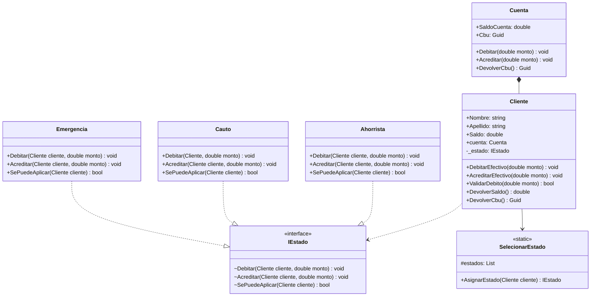

# Diagrama Banco

```mermaid
classDiagram

class Cliente {
    +Nombre: string
    +Apellido: string
    +Saldo: double
    +cuenta: Cuenta
    -_estado: IEstado
    +DebitarEfectivo(double monto) void
    +AcreditarEfectivo(double monto) void
    +ValidarDebito(double monto) bool
    +DevolverSaldo() double
    +DevolverCbu() Guid
}

class Cuenta {
    +SaldoCuenta: double
    +Cbu: Guid
    +Debitar(double monto) void
    +Acreditar(double monto) void
    +DevolverCbu() Guid
}

class IEstado {
    <<interface>>
    ~Debitar(Cliente cliente, double monto) void
    ~Acreditar(Cliente cliente, double monto) void
    ~SePuedeAplicar(Cliente cliente) bool
}

class Cauto {
    +Debitar(Cliente, double monto) void
    +Acreditar(Cliente cliente, double monto) void
    +SePuedeAplicar(Cliente cliente) bool
}

class Emergencia {
    +Debitar(Cliente cliente, double monto) void
    +Acreditar(Cliente cliente, double monto) void
    +SePuedeAplicar(Cliente cliente) bool
}

class Ahorrista {
    +Debitar(Cliente cliente, double monto) void
    +Acreditar(Cliente cliente, double monto) void
    +SePuedeAplicar(Cliente cliente) bool
}

class SelecionarEstado {
    <<static>>
    #estados: List<IEstado>
    +AsignarEstado(Cliente cliente) IEstado
}

Emergencia ..|> IEstado
Cauto ..|> IEstado
Ahorrista ..|> IEstado
Cuenta *-- Cliente
Cliente ..> IEstado
Cliente --> SelecionarEstado
```
