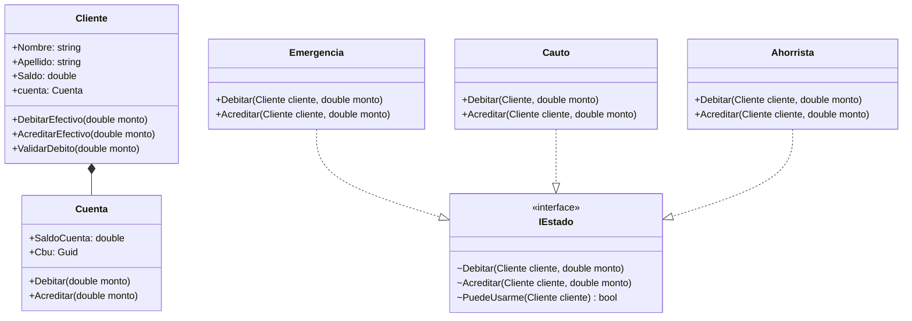

# Diagrama Banco

```mermaid
classDiagram

class Cliente {
    +Nombre: string
    +Apellido: string
    +Saldo: double
    +cuenta: Cuenta
    +DebitarEfectivo(double monto)
    +AcreditarEfectivo(double monto)
    +ValidarDebito(double monto)
}

class Cuenta {
    +SaldoCuenta: double
    +Cbu: Guid
    +Debitar(double monto)
    +Acreditar(double monto)
}

class IEstado {
    <<interface>>
    ~Debitar(Cliente cliente, double monto)
    ~Acreditar(Cliente cliente, double monto)
    ~PuedeUsarme(Cliente cliente) bool
}

class Cauto {
    +Debitar(Cliente, double monto)
    +Acreditar(Cliente cliente, double monto)    
}

class Emergencia {
    +Debitar(Cliente cliente, double monto)
    +Acreditar(Cliente cliente, double monto)    
}

class Ahorrista {
    +Debitar(Cliente cliente, double monto)
    +Acreditar(Cliente cliente, double monto)    
}

Emergencia ..|> IEstado
Cauto ..|> IEstado
Ahorrista ..|> IEstado
Cliente *-- Cuenta
```
