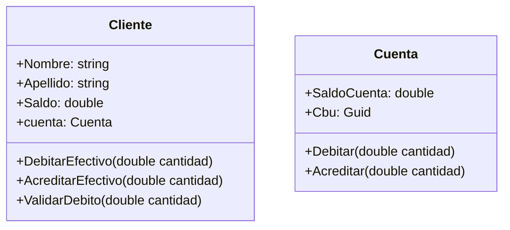

# Diagrama Banco

```mermaid
classDiagram

class Cliente {
    +Nombre: string
    +Apellido: string
    +Saldo: double
    +cuenta: Cuenta
    +DebitarEfectivo(double cantidad)
    +AcreditarEfectivo(double cantidad)
    +ValidarDebito(double cantidad)
}

class Cuenta {
    +SaldoCuenta: double
    +Cbu: Guid
    +Debitar(double cantidad)
    +Acreditar(double cantidad)
}
```